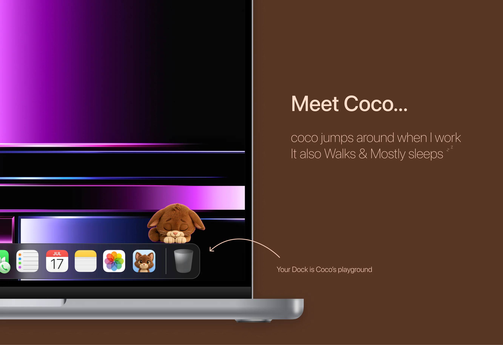

# Coco



Coco is a little desktop pet for macOS. A fluffy brown cat lives on your screen, keeps you company while you work, and reacts to what you're doing.

## Features

- **Works with you.** Coco types on its own laptop while you type, and looks thoughtful when you pause.
- **Watches you.** Move the mouse and Coco turns its head to follow the cursor.
- **Has a life of its own.** Coco blinks, tilts its head, and wanders off for short walks.
- **Naps.** Step away and Coco waits, then curls up and falls asleep. It wakes up when you're back.
- **Stays out of the way.** Coco floats above your windows without ever taking focus from the app you're using.
- **Light on your Mac.** The animation pauses while your screen is locked or the display is asleep.
- **Private.** Coco only notices *that* you're typing, never *what* you type, so it needs no special permissions.

## Requirements

macOS 13 Ventura or later, on Apple Silicon or Intel Macs.

## Installation

1. Download Coco from the Releases page and open the download (a `.dmg` or `.zip`).
2. Drag **Coco** into the **Applications** folder.
3. Open Coco from Applications.

### Opening Coco for the first time

Coco isn't distributed through the Mac App Store, so macOS may block it the first time you open it. To allow it, do either of these once:

- Open **System Settings → Privacy & Security**, scroll down, and click **Open Anyway** next to the message about Coco.
- Or run this in Terminal:

  ```sh
  xattr -dr com.apple.quarantine /Applications/Coco.app
  ```

After that, Coco opens normally.

## Using Coco

### Moods

With **Follow My Activity** turned on (the default), Coco mirrors what you're doing:

| When you're… | Coco… |
|---|---|
| Typing | types on its laptop |
| Pausing after a long stretch of typing | looks thoughtful for a moment |
| Moving the mouse | follows the cursor with its eyes |
| Idle for a little while | idles, blinks and sometimes goes for a walk |
| Away for 15 seconds | waits patiently |
| Away for 30 seconds | curls up and falls asleep |
| Back again | wakes up and sits up |

To keep Coco in one mood, right-click it and choose **Stay…** → Idle, Working, Waiting, Thinking or Sleeping. Choose **Follow My Activity** from the same menu to go back.

### Playing with Coco

| Action | What happens |
|---|---|
| Hover over Coco | it waves |
| Click Coco | it jumps (or wakes up, if asleep) |
| Drag Coco | it leans as you carry it; it remembers where you put it |
| Right-click Coco | menu with Wave, Jump, Oops, Go for a Walk, moods, size, hide and quit |

### Size

Make Coco bigger or smaller in any of these ways:

- Right-click → **Size** → Larger, Smaller, or a preset (Small, Medium, Large, Extra Large)
- Hold **⌥ Option** and scroll over Coco
- Press **⌘ =** or **⌘ −** while Coco is the active app

Sizes range from 50% to 150%, and your choice is remembered.

### Hiding and quitting

- **Hide:** right-click Coco → **Hide Coco**, or press **⌘ H** while Coco is the active app. Click Coco's Dock icon to bring it back.
- **Quit:** right-click Coco → **Quit Coco**, or press **⌘ Q** while Coco is the active app.
- **Keep in Dock:** while Coco is running, right-click its Dock icon → **Options → Keep in Dock**.

## Building from source

You'll need Xcode 16 or later.

- **Run:** open `Coco.xcodeproj` and press **Run** (⌘R).
- **Make a copy to share:** choose **Product → Archive**, then in the Organizer click **Distribute App → Custom → Copy App** to export `Coco.app`.

### Project layout

```
Coco.xcodeproj           Xcode project
Info.plist
Sources/CocoDesktopPet/
  CocoApp.swift          App entry point and menus
  PetController.swift    Activity tracking, moods, walking, dragging and sizing
  SpriteView.swift       Frame playback, crossfades and procedural motion
Assets/
  Frames/                Animation frames, one folder per animation
  Coco.xcassets/         App icon
  Icon/Coco-1024.png     Full-size icon
  Marketing/banner.webp  Banner image
Art/                     Original artwork the frames and icon are made from
```

### How the animation works

Coco's frames are separate poses rather than full in-between frames. To make the motion feel smooth, the app renders at 60 fps with Core Animation, crossfades between poses, and adds procedural motion on top: breathing, squash and stretch, hops with gravity, a walking bob, a typing tap, and leaning while dragged.
